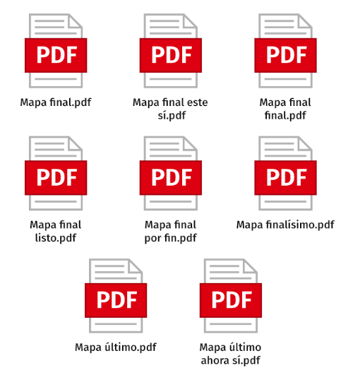
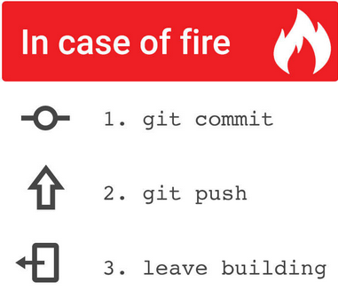

_Sesión de Activación_

# Git Camp

PILOTO

Laboratoria

---

## La vida antes de Git

{ width=30% }

* Múltiples copias

---

### La vida antes de Git

* Pérdida de datos

---

### Git nos reporta

{ width=50% }

* ¿Qué cambió?
* ¿Quién hizo qué, y cuándo?
* ¿Cuándo se rompió?
* ¿Cómo estaba la semana pasada?

<aside class="notes">HOLA PROBANDO</aside>

---

## Flujo de Trabajo de Git

{ width=50% }

* Ramas por tarea (no-interferencia)
* Colaboración e integración de cambios
* Experimentos
* Mantenimiento de versiones anteriores

---

# DEMO 1/3

## git status / git log / git diff

* [x]  fork en Github + git clone

---

# DEMO 2/3

* [x] crear un archivo
* [x] commit + push

_excepcionalmente haremos el primer commit a main_

---

# DEMO 3/3

* [x] crear rama
* [x] commit + push + PR + merge
* [x] checkout main + pull
